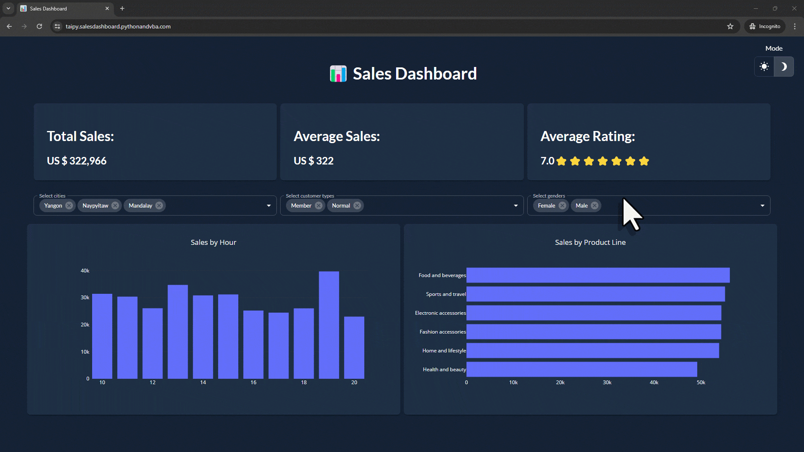

# 📊 Interactive Sales Dashboard with Python (Taipy)

Sales Dashboard built-in Python and the Taipy library to visualize Excel data.<br>

## Video Tutorial
[](https://youtu.be/_KaVKeP5xIA)

## Dashboard Demo


## Run the app
```Powershell
# vanilla terminal
python main.py

# quit
ctrl-c
```


## 🤓 Check Out My Excel Add-ins
I've developed some handy Excel add-ins that you might find useful:

- 📊 **[Dashboard Add-in](https://pythonandvba.com/grafly)**: Easily create interactive and visually appealing dashboards.
- 🎨 **[Cartoon Charts Add-In](https://pythonandvba.com/cuteplots)**: Create engaging and fun cartoon-style charts.
- 🤪 **[Emoji Add-in](https://pythonandvba.com/emojify)**: Add a touch of fun to your spreadsheets with emojis.
- 🛠️ **[MyToolBelt Add-in](https://pythonandvba.com/mytoolbelt)**: A versatile toolbelt for Excel, featuring:
  - Creation of Pandas DataFrames and Jupyter Notebooks from Excel ranges
  - ChatGPT integration for advanced data analysis
  - And much more!


## 🤝 Connect with Me
- 📺 **YouTube:** [CodingIsFun](https://youtube.com/c/CodingIsFun)
- 🌐 **Website:** [PythonAndVBA](https://pythonandvba.com)
- 💬 **Discord:** [Join our Community](https://pythonandvba.com/discord)
- 💼 **LinkedIn:** [Sven Bosau](https://www.linkedin.com/in/sven-bosau/)
- 📸 **Instagram:** [Follow me](https://www.instagram.com/sven_bosau/)

## ☕️ Support My Work
Love my content and want to show appreciation? Why not [buy me a coffee](https://pythonandvba.com/coffee-donation) to fuel my creative engine? Your support means the world to me! 😊

[](https://pythonandvba.com/coffee-donation)

## 💌 Feedback
Got some thoughts or suggestions? Don't hesitate to reach out to me at contact@pythonandvba.com. I'd love to hear from you! 💡

